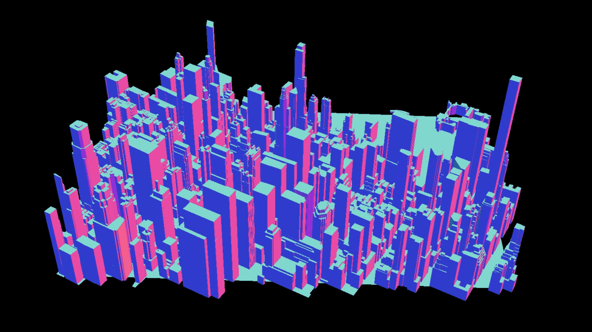

# visavis
A small personal project to learn JavaScript and THREE.js. Coming from Processing, I found THREE.js to be insanely fast for being executed in the Browser.

### Manhattan 
`manhattan_big.obj` rendered with `MeshPhongMaterial`, `drawWireframe = false` and proper alignment with the center coordinates.

### Mt. Everest 
With several shaders implemented. Shaders and `audioHandler.js` are borrowed from [here](https://www.airtightinteractive.com/demos/js/badtvshader/). Generally, [airtightinteractive.com](https://www.airtightinteractive.com/2013/10/making-audio-reactive-visuals/) was a great resource for me to learn THREE.js. 

