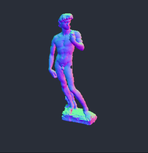

# visavis
This is a small personal project to learn JavaScript and THREE.js (my first time writing JS, please be nice). Coming from Processing, I found THREE.js to be insanely fast for being executed in the Browser.

The 3D OBJ animated geo models shown here were downloaded using this little [tool](https://github.com/karimnaaji/vectiler).


### David
Here we load a model of the famous David sculpture by Michelangelo. The center of the wave is visible as a black dot on his right leg (which is a bug actually). The waves propagate along his body.



Now we don't loop through every single vortex and apply the wave ampltide to it but select each vertex with a 10% change like this:

```javascript	
for ( var i = 0, l = cityGeometry.vertices.length; i < l; i += 1 ) {
	if (Math.random() < 0.1) {
	var roofDistanceToCenter = Math.sqrt((center.x+originalPositions[ i ].x)**2 + (center.y+originalPositions[ i ].y)**2);
	var normDistance = historyLength - Math.round( roofDistanceToCenter / maxDistance * historyLength );
	cityGeometry.vertices[ i ].z = originalPositions[ i ].z + volumeHistory[normDistance] * 10;
	}
}
```


